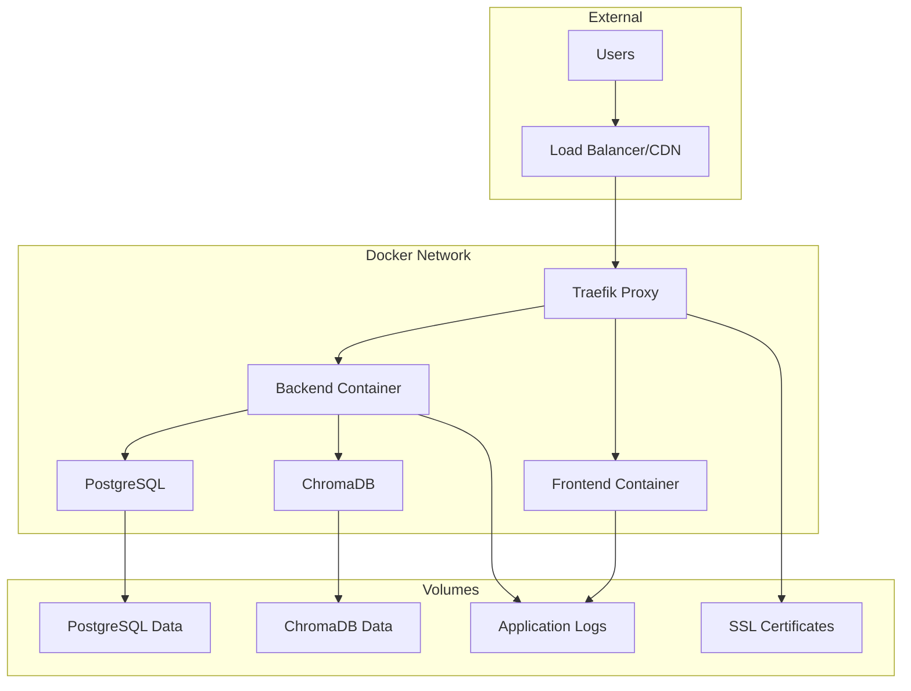

# Docker Configuration Guide

This document provides comprehensive information about the Docker setup for the Learn2Play application, including production optimizations, security hardening, and multi-environment support.

## Table of Contents

- [Overview](#overview)
- [Architecture](#architecture)
- [Environment Profiles](#environment-profiles)
- [Quick Start](#quick-start)
- [Configuration](#configuration)
- [Security Features](#security-features)
- [Monitoring and Logging](#monitoring-and-logging)
- [Troubleshooting](#troubleshooting)
- [Best Practices](#best-practices)

## Overview

The Learn2Play Docker configuration supports three distinct environments:

- **Development**: Local development with hot reloading and debugging tools
- **Test**: Isolated testing environment with test data and services
- **Production**: Optimized production deployment with security hardening

## Architecture

### Production Architecture



### Container Details

| Container | Base Image | Purpose | Resources |
|-----------|------------|---------|-----------|
| Frontend | nginx:alpine | Serves React app | 256MB RAM, 0.5 CPU |
| Backend | node:18-alpine | API server | 1GB RAM, 1.0 CPU |
| PostgreSQL | postgres:15-alpine | Primary database | 1GB RAM, 1.0 CPU |
| ChromaDB | chromadb/chroma | Vector database | 2GB RAM, 1.0 CPU |
| Traefik | traefik:v3.0 | Reverse proxy | 256MB RAM, 0.5 CPU |

## Environment Profiles

### Development Profile

**Purpose**: Local development with hot reloading and debugging

**Services**:
- PostgreSQL (exposed on port 5432)
- ChromaDB (for vector operations)
- Backend Development Server (with hot reload)
- Frontend Development Server (with hot reload)

**Usage**:
```bash
./docker-manager.sh -e development up -d
```

**Features**:
- Source code mounted as volumes for hot reloading
- Debug logging enabled
- Development-friendly environment variables
- No SSL/TLS requirements

### Test Profile

**Purpose**: Isolated testing environment with test data

**Services**:
- PostgreSQL Test (port 5433)
- ChromaDB Test (port 8001)
- Backend Test Server
- Frontend Test Server
- MailHog (email testing)
- Redis (session/cache testing)

**Usage**:
```bash
./docker-manager.sh -e test up --build
```

**Features**:
- Isolated test databases with test data
- Temporary volumes (tmpfs) for speed
- Email testing with MailHog
- Test-specific environment variables
- Automatic cleanup after tests

### Production Profile

**Purpose**: Optimized production deployment

**Services**:
- PostgreSQL (with performance tuning)
- ChromaDB (production configuration)
- Backend API (optimized build)
- Frontend (nginx with caching)
- Traefik (SSL termination and load balancing)

**Usage**:
```bash
./docker-manager.sh -e production up -d
```

**Features**:
- Multi-stage Docker builds for smaller images
- Security hardening (non-root users, read-only filesystems)
- SSL/TLS termination with Let's Encrypt
- Health checks and automatic restarts
- Resource limits and monitoring
- Structured logging

## Quick Start

### Prerequisites

- Docker Engine 20.10+
- Docker Compose 2.0+
- At least 4GB RAM available
- 10GB free disk space

### Initial Setup

1. **Clone the repository and navigate to the project directory**

2. **Create environment configuration**:
   ```bash
   cp .env.example .env
   # Edit .env with your configuration
   ```

3. **Start the desired environment**:
   ```bash
   # Development
   ./docker-manager.sh -e development up -d
   
   # Test
   ./docker-manager.sh -e test up --build
   
   # Production
   ./docker-manager.sh -e production up -d
   ```

4. **Verify services are running**:
   ```bash
   ./docker-manager.sh -e production ps
   ```

### Environment URLs

| Environment | Frontend | Backend API | Database |
|-------------|----------|-------------|----------|
| Development | http://localhost:3000 | http://localhost:3001/api | localhost:5432 |
| Test | http://localhost:3000 | http://localhost:3001/api | localhost:5433 |
| Production | https://your-domain.com | https://your-domain.com/api | Internal only |

## Configuration

### Environment Variables

The application uses environment variables for configuration. Key variables include:

#### Database Configuration
```bash
POSTGRES_DB=learn2play
POSTGRES_USER=l2p_user
POSTGRES_PASSWORD=your_secure_password
DB_SSL=true
```

#### Application Configuration
```bash
JWT_SECRET=your_jwt_secret_minimum_32_chars
JWT_REFRESH_SECRET=your_jwt_refresh_secret
FRONTEND_URL=https://your-domain.com
LOG_LEVEL=info
```

#### External Services
```bash
GEMINI_API_KEY=your_gemini_api_key
SMTP_HOST=smtp.your-provider.com
SMTP_USER=your-email@domain.com
```

### Volume Configuration

#### Production Volumes
- **postgres_data**: PostgreSQL data persistence
- **chroma_data**: ChromaDB vector data
- **letsencrypt_data**: SSL certificates
- **backend_logs**: Application logs
- **frontend_logs**: Nginx access logs
- **traefik_logs**: Proxy logs

#### Volume Paths
Configure volume paths using environment variables:
```bash
DATA_PATH=./data          # Data storage location
LOGS_PATH=./logs          # Log storage location
```

### Network Configuration

#### Production Network
- **l2p-network**: Bridge network (172.20.0.0/16)
- Internal service communication
- Traefik handles external access

#### Test Network
- **test-network**: Isolated bridge network (172.21.0.0/16)
- Prevents interference with other environments

## Security Features

### Container Security

1. **Non-root Users**: All containers run as non-root users
2. **Read-only Filesystems**: Production containers use read-only root filesystems
3. **No New Privileges**: Prevents privilege escalation
4. **Resource Limits**: CPU and memory limits prevent resource exhaustion
5. **Security Options**: Additional security constraints applied

### Network Security

1. **Internal Networks**: Services communicate over internal Docker networks
2. **Minimal Port Exposure**: Only necessary ports exposed to host
3. **Traefik Security**: Automatic HTTPS, security headers, rate limiting

### Data Security

1. **Encrypted Connections**: SSL/TLS for all external communications
2. **Secure Defaults**: Strong authentication methods for databases
3. **Secret Management**: Environment variables for sensitive data
4. **Volume Permissions**: Proper file permissions on mounted volumes

### Example Security Configuration

```yaml
security_opt:
  - no-new-privileges:true
read_only: true
tmpfs:
  - /tmp
  - /var/run
deploy:
  resources:
    limits:
      memory: 1G
      cpus: '1.0'
```

## Monitoring and Logging

### Health Checks

All services include comprehensive health checks:

```yaml
healthcheck:
  test: ["CMD", "curl", "-f", "http://localhost:80/health"]
  interval: 30s
  timeout: 10s
  retries: 3
  start_period: 30s
```

### Logging Configuration

Structured logging with rotation:

```yaml
logging:
  driver: "json-file"
  options:
    max-size: "10m"
    max-file: "3"
```

### Metrics and Monitoring

- **Traefik Metrics**: Prometheus metrics on port 8080
- **Application Logs**: Structured JSON logging
- **Health Endpoints**: Service health monitoring
- **Resource Monitoring**: Docker stats and resource usage

### Log Aggregation

The `logrotate` service automatically manages log rotation:
- Daily rotation
- 7-day retention
- Compression enabled
- Automatic cleanup

## Troubleshooting

### Common Issues

#### Services Won't Start

1. **Check environment file**:
   ```bash
   # Ensure .env file exists and is properly configured
   ls -la .env
   ```

2. **Verify Docker resources**:
   ```bash
   docker system df
   docker system prune -f  # Clean up if needed
   ```

3. **Check service logs**:
   ```bash
   ./docker-manager.sh -e production logs -f
   ```

#### Database Connection Issues

1. **Verify database is healthy**:
   ```bash
   docker-compose --profile production ps postgres
   ```

2. **Check database logs**:
   ```bash
   docker-compose --profile production logs postgres
   ```

3. **Test connection**:
   ```bash
   ./docker-manager.sh -e production exec postgres psql -U l2p_user -d learn2play
   ```

#### SSL Certificate Issues

1. **Check Traefik logs**:
   ```bash
   docker-compose --profile production logs traefik
   ```

2. **Verify domain configuration**:
   ```bash
   # Ensure DOMAIN and LETSENCRYPT_EMAIL are set in .env
   grep -E "DOMAIN|LETSENCRYPT_EMAIL" .env
   ```

3. **Check certificate storage**:
   ```bash
   ls -la ./data/letsencrypt/
   ```

### Performance Issues

#### High Memory Usage

1. **Check resource usage**:
   ```bash
   docker stats
   ```

2. **Adjust resource limits** in docker-compose.yml:
   ```yaml
   deploy:
     resources:
       limits:
         memory: 2G  # Increase if needed
   ```

#### Slow Database Performance

1. **Check PostgreSQL configuration**:
   ```bash
   ./docker-manager.sh -e production exec postgres cat /etc/postgresql/postgresql.conf
   ```

2. **Monitor database performance**:
   ```bash
   ./docker-manager.sh -e production exec postgres psql -U l2p_user -d learn2play -c "SELECT * FROM pg_stat_activity;"
   ```

### Debugging Commands

```bash
# View all containers
./docker-manager.sh -e production ps

# Follow logs for all services
./docker-manager.sh -e production logs -f

# Execute commands in containers
./docker-manager.sh -e production exec backend bash
./docker-manager.sh -e production exec postgres psql -U l2p_user -d learn2play

# Check container resource usage
docker stats

# Inspect container configuration
docker inspect l2p-api

# View network configuration
docker network ls
docker network inspect l2p_l2p-network
```

## Best Practices

### Development

1. **Use development profile** for local development
2. **Mount source code** as volumes for hot reloading
3. **Use debug logging** to troubleshoot issues
4. **Keep development and production configs in sync**

### Testing

1. **Use isolated test environment** with test profile
2. **Clean up test data** between test runs
3. **Use tmpfs volumes** for better test performance
4. **Include all external dependencies** in test environment

### Production

1. **Use specific image tags** instead of `latest`
2. **Implement proper backup strategies** for data volumes
3. **Monitor resource usage** and adjust limits as needed
4. **Regularly update base images** for security patches
5. **Use secrets management** for sensitive data
6. **Implement log rotation** to prevent disk space issues
7. **Set up monitoring and alerting** for production services

### Security

1. **Never commit secrets** to version control
2. **Use strong passwords** and rotate them regularly
3. **Keep Docker and base images updated**
4. **Implement network segmentation** where possible
5. **Use read-only filesystems** in production
6. **Regularly audit container configurations**
7. **Monitor for security vulnerabilities**

### Maintenance

1. **Regular backups** of data volumes
2. **Monitor disk space** usage
3. **Update dependencies** regularly
4. **Test disaster recovery** procedures
5. **Document configuration changes**
6. **Implement automated health checks**
7. **Plan for scaling** as usage grows

## Docker Manager Script

The included `docker-manager.sh` script provides convenient management of Docker environments:

```bash
# Start development environment
./docker-manager.sh -e development up -d

# Build and start test environment
./docker-manager.sh -e test up --build

# Follow production logs
./docker-manager.sh -e production logs -f

# Execute command in backend container
./docker-manager.sh -e production exec backend npm run migrate

# Clean up unused resources
./docker-manager.sh cleanup
```

For complete usage information:
```bash
./docker-manager.sh --help
```

This comprehensive Docker setup provides a robust, secure, and scalable foundation for the Learn2Play application across all deployment environments.