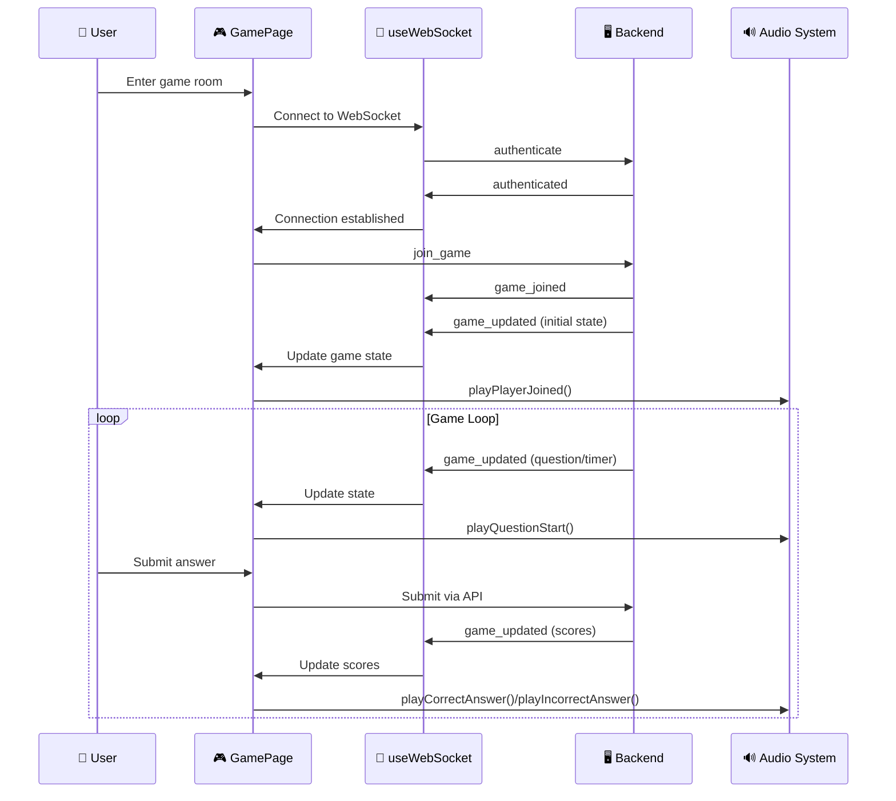
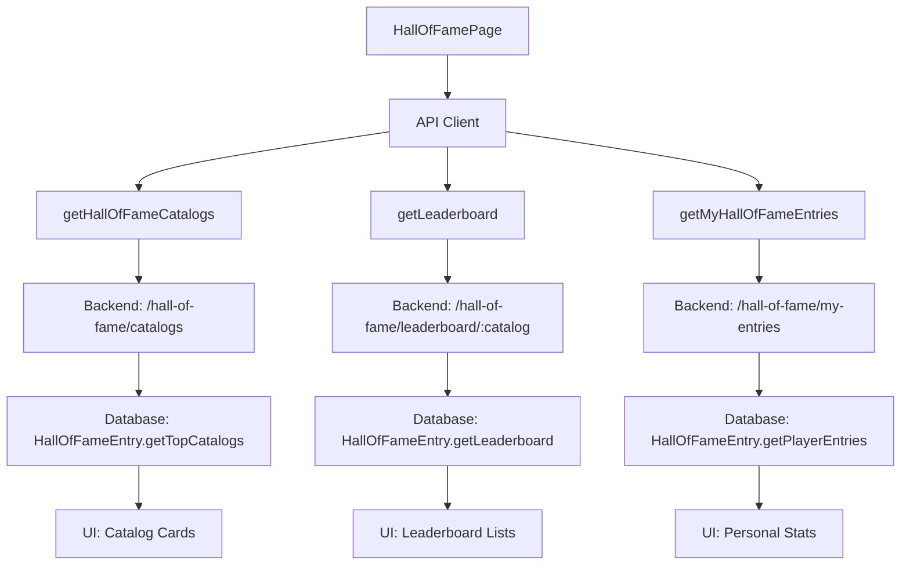

# 🎮 Component Interactions & System Architecture

## 📋 Overview

This document outlines the complete interaction model between frontend components, backend services, and real-time features in the Learn2Play multiplayer quiz game system.

## 🏗️ Application Architecture

```
┌─────────────────────────────────────────────────────────────────┐
│                        App.tsx                                  │
│  ┌─────────────────────────────────────────────────────────┐    │
│  │              Providers Layer                            │    │
│  │  ┌─── ErrorBoundary                                  │    │    │
│  │  │  ┌─── QueryClientProvider                        │    │    │
│  │  │  │  ┌─── ThemeProvider                          │    │    │
│  │  │  │  │  ┌─── NotificationProvider (🔊 Audio)    │    │    │
│  │  │  │  │  │  ┌─── AuthProvider                   │    │    │
│  │  │  │  │  │  │  ┌─── Router                     │    │    │
│  │  │  │  │  │  │  │                               │    │    │
│  │  │  │  │  │  │  └─── Layout                     │    │    │
│  │  │  │  │  │  └─────────────────────────────────────│    │    │
│  │  │  │  │  └─────────────────────────────────────────│    │    │
│  │  │  │  └─────────────────────────────────────────────│    │    │
│  │  │  └─────────────────────────────────────────────────│    │    │
│  │  └─────────────────────────────────────────────────────│    │    │
│  └─────────────────────────────────────────────────────────│    │    │
│                                                             │    │
│  AudioControlWidget (🎵 Fixed Position)                     │    │
└─────────────────────────────────────────────────────────────────┘
```

## 🔄 Real-Time Game Flow

### 1. WebSocket Connection Lifecycle



### 2. Game State Management Integration

```typescript
// GamePage.tsx - Real-time state synchronization
const GamePage = () => {
  const { socket, isConnected, subscribe } = useWebSocket();
  const { 
    playCorrectAnswer, 
    playIncorrectAnswer, 
    playTimeWarning,
    playGameStart,
    playGameEnd 
  } = useAudio();

  // WebSocket event handlers with audio feedback
  useEffect(() => {
    const unsubscribeGameUpdate = subscribe('game_updated', (lobbyData) => {
      updateLobby(lobbyData);
      
      // Audio feedback based on game phase
      if (lobbyData.game_phase === 'question' && lobbyData.question_start_time) {
        startQuestionTimer(lobbyData.question_start_time);
      } else if (lobbyData.game_phase === 'finished') {
        playGameEnd();
        showSuccess('Game Complete', 'Game completed!');
      }
    });

    return unsubscribeGameUpdate;
  }, [socket, subscribe, playGameEnd]);
};
```

## 🎵 Audio System Architecture

### Audio Integration Flow

```
┌─────────────────────────────────────────────────────────────────┐
│                     useAudio Hook                               │
│  ┌─────────────────────────────────────────────────────────┐    │
│  │              AudioManager                               │    │
│  │  • Web Audio API Context                               │    │
│  │  • Tone Generation (Oscillators)                       │    │
│  │  • Volume Controls                                     │    │
│  │  • Settings Persistence                                │    │
│  └─────────────────────────────────────────────────────────┘    │
└─────────────────────────────────────────────────────────────────┘
                                │
                                ▼
┌─────────────────────────────────────────────────────────────────┐
│                Component Integration                             │
│                                                                 │
│  Button.tsx           NotificationProvider.tsx    GamePage.tsx  │
│  ┌─────────────┐      ┌─────────────────────┐    ┌───────────┐  │
│  │ onClick     │      │ showNotification    │    │ Game      │  │
│  │ ↓           │      │ ↓                   │    │ Events    │  │
│  │playButtonClick│      │playCorrectAnswer   │    │ ↓         │  │
│  └─────────────┘      │playIncorrectAnswer  │    │Audio      │  │
│                       │playNotification     │    │Feedback   │  │
│                       └─────────────────────┘    └───────────┘  │
└─────────────────────────────────────────────────────────────────┘
```

### Audio Events Mapping

| Component Event | Audio Feedback | Tone Description |
|----------------|----------------|------------------|
| Button Click | `playButtonClick()` | Quick 800Hz beep (0.1s) |
| Correct Answer | `playCorrectAnswer()` | C Major chord (523-784Hz, 0.5s) |
| Incorrect Answer | `playIncorrectAnswer()` | Descending 220-196Hz (0.3s) |
| Notification Success | `playCorrectAnswer()` | Pleasant ascending chord |
| Notification Error | `playIncorrectAnswer()` | Lower warning tone |
| Game Start | `playGameStart()` | Triumphant C4-E4-G4-C5 sequence |
| Game End | `playGameEnd()` | Victory fanfare chord |
| Time Warning | `playTimeWarning()` | Urgent 1000Hz beeping (3x) |
| Player Joined | `playPlayerJoined()` | Welcoming two-tone |
| Player Left | `playPlayerLeft()` | Descending farewell |
| Multiplier Bonus | `playMultiplierBonus()` | Escalating excitement |

## 🏆 Enhanced Hall of Fame System

### Data Flow Architecture



### Personal Statistics Calculation

```typescript
// HallOfFamePage.tsx - Enhanced statistics
const calculatePersonalStats = () => {
  if (!myStats?.entries?.length) return null;

  const entries = myStats.entries;
  const totalScore = entries.reduce((sum, entry) => sum + (entry.score || 0), 0);
  const totalQuestions = entries.reduce((sum, entry) => sum + (entry.questions_answered || 0), 0);
  const totalCorrect = entries.reduce((sum, entry) => sum + (entry.questions_correct || 0), 0);
  const bestScore = Math.max(...entries.map(entry => entry.score || 0));

  return {
    totalGames: entries.length,
    totalScore,
    bestScore,
    averageScore: Math.round(totalScore / entries.length),
    overallAccuracy: totalQuestions > 0 ? Math.round((totalCorrect / totalQuestions) * 100) : 0
  };
};
```

## 🎛️ Audio Control System

### AudioControlWidget Integration

```
┌─────────────────────────────────────────────────────────────────┐
│                 Fixed Position Widget                           │
│  ┌─────────────────────────────────────────────────────────┐    │
│  │              AudioControlWidget                         │    │
│  │  • Floating Button (Bottom Right)                      │    │
│  │  • Current State Indicator (🔊/🔈/🔇)                   │    │
│  │  • Click → Opens AudioSettings Modal                   │    │
│  └─────────────────────────────────────────────────────────┘    │
│                                │                                │
│                                ▼                                │
│  ┌─────────────────────────────────────────────────────────┐    │
│  │              AudioSettings Modal                        │    │
│  │  ┌─ Enable Audio Toggle                                │    │
│  │  ┌─ Mute All Sounds Toggle                             │    │
│  │  ┌─ Master Volume Slider (0-100%)                      │    │
│  │  ┌─ Sound Effects Volume Slider (0-100%)               │    │
│  │  ┌─ Test Sound Button                                  │    │
│  │  ┌─ Reset to Default                                   │    │
│  │  └─ Audio Support Status Indicator                     │    │
│  └─────────────────────────────────────────────────────────┘    │
└─────────────────────────────────────────────────────────────────┘
```

## 🔄 State Management Flow

### Zustand Store Integration

```typescript
// gameStore.ts - Enhanced with audio
export const useGameStore = create<GameStore>()(
  subscribeWithSelector((set, get) => ({
    // WebSocket state updates with audio feedback
    updateLobby: (lobbyState: LobbyState) => {
      const prevState = get().currentLobby;
      set({ currentLobby: lobbyState });
      
      // Trigger audio based on state changes
      if (prevState?.players?.length !== lobbyState.players?.length) {
        // Player joined/left audio feedback handled by GamePage
      }
    },
    
    // Score updates with celebration sounds
    updateScore: (score: number) => {
      const prevScore = get().playerScore;
      set({ playerScore: score });
      
      if (score > prevScore) {
        // Score increase - audio feedback in GamePage
      }
    }
  }))
);
```

## 🎮 Complete Game Integration Examples

### Real-time Question Progression

```typescript
// GamePage.tsx - Synchronized question handling
const startQuestionTimer = useCallback((questionStartTime: string) => {
  const startTime = new Date(questionStartTime);
  const questionDuration = 60; // seconds
  
  const updateTimerInterval = setInterval(() => {
    const now = new Date();
    const elapsed = Math.floor((now.getTime() - startTime.getTime()) / 1000);
    const remaining = Math.max(0, questionDuration - elapsed);
    
    updateTimer(remaining);
    
    // Audio warning for time running out
    if (remaining === 10) {
      playTimeWarning();
    }
    
    if (remaining <= 0) {
      clearInterval(updateTimerInterval);
    }
  }, 1000);
  
  return () => clearInterval(updateTimerInterval);
}, [updateTimer, playTimeWarning]);
```

### Enhanced Player Experience

```typescript
// Real-time player status with visual and audio feedback
{players.map(player => (
  <PlayerCard key={player.username} isCurrentUser={player.username === user?.username}>
    <PlayerName>
      {player.character} {player.username}
      {player.is_host && ' 👑'}
      {player.answered && gamePhase === 'question' && ' ✅'}
    </PlayerName>
    <PlayerScore>{player.score || 0} points</PlayerScore>
  </PlayerCard>
))}
```

## 🔧 Development Integration Points

### Key Hooks and Services

1. **useWebSocket** - Real-time communication
2. **useAudio** - Sound system integration  
3. **useNotification** - User feedback system
4. **useGameStore** - State management
5. **apiClient** - Backend communication

### Component Enhancement Pattern

```typescript
// Pattern for adding audio to any component
const MyComponent = () => {
  const { playButtonClick, playNotification } = useAudio();
  const { showSuccess } = useNotification();
  
  const handleAction = async () => {
    playButtonClick(); // Immediate feedback
    
    try {
      await performAction();
      showSuccess('Success!', 'Action completed'); // Auto-plays success sound
    } catch (error) {
      showError('Failed', error.message); // Auto-plays error sound
    }
  };
  
  return <Button onClick={handleAction} enableSound={false}>Action</Button>;
  // Note: enableSound={false} to avoid double audio
};
```

## 📊 Performance Considerations

### Audio System Optimization

- **Lazy Initialization**: Audio context created on first user interaction
- **Tone Generation**: Programmatic audio generation (no file loading)
- **Memory Management**: Proper cleanup of audio nodes and intervals
- **Browser Compatibility**: Fallback for unsupported browsers

### WebSocket Optimization

- **Connection Management**: Auto-reconnect with exponential backoff
- **Event Subscription**: Efficient event listener management
- **State Synchronization**: Optimistic updates with server confirmation

## 🚀 Future Enhancement Opportunities

1. **Advanced Audio**: 
   - Background music with dynamic mixing
   - 3D spatial audio for multiplayer positioning
   - Customizable sound packs

2. **Enhanced Real-time Features**:
   - Voice chat integration
   - Real-time drawing/collaboration
   - Live spectator mode

3. **Analytics Integration**:
   - Real-time game metrics
   - Player behavior tracking
   - Performance optimization data

---

*This documentation reflects the current implementation as of the latest development cycle. The system provides a solid foundation for a production-ready multiplayer quiz game with comprehensive audio feedback and real-time synchronization.* 